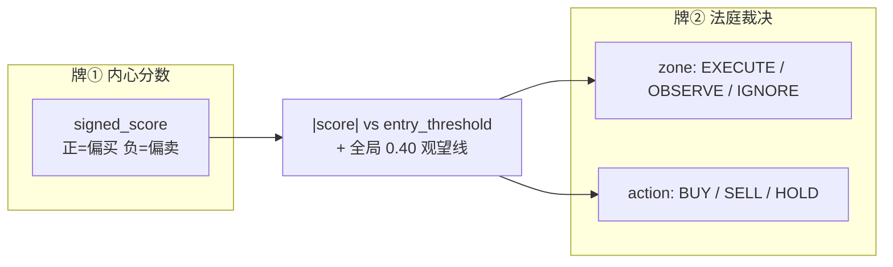
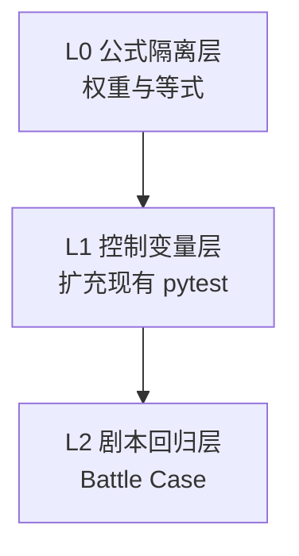

# 《熊猫判决实验室》— Decision Engine 测试方案报告

> 版本 1.0 · 2026-05-20  
> 读者：开发 / 测试 / 产品  
> 代码锚点：`app/engine/decision_pipeline.py`、`tests/`

---

## 序言：你理解得完全正确

八步管线跑完之后，对外就是一张 **判决书**：

- **买（BUY）** / **卖（SELL）** / **先别动（HOLD）**
- 以及判词力度：冲（EXECUTE）、纠结（OBSERVE）、装死（IGNORE）

现有的 L1 单元测试，本质上就是 **控制变量法**——同一张行情卷子、同一套策略，每次只拧一个旋钮，看判决有没有按设计偏转。

**但法庭上有几十个旋钮，目前只拧了大约三分之一；Step 4 的融合权重几乎还没上过证人席。**

本报告说明：判决是什么、现在测了什么、缺了什么、完整测试方案怎么搭。

---

## 第一章：八步之后，到底判了什么？

结局是 **两张牌**，不是一张：



| 输出 | 含义 |
|------|------|
| `final_score` | Step 8 后 × 方向；绝对值 = 有多想动手 |
| `zone` | `\|score\| > entry_threshold` → EXECUTE；`≥ 0.40` → OBSERVE；否则 IGNORE |
| `action` | EXECUTE 且方向≥0 → BUY；方向&lt;0 → SELL；否则 HOLD |
| `entry_delay` | 耐性：等几根 K 线再执行（Step 5） |
| `entry_threshold` | 个人化门槛（胆识 + 情绪修正，Step 5/8） |
| `position_factor` 等 | 真动手时的仓位（PandaActor 用，Step 5/8） |

**测试不应只断言 `action`**，还应断言 `zone`、`entry_threshold`，以及 **`steps[n].score` 是否符合公式**——这才叫「测权重」。

---

## 第二章：现在的 L1 在干什么？

### 2.1 实验室规则

> 同一张行情 + 同一套策略，其它全锁死，只改一个因素，看判决是否按预期偏转。

### 2.2 已挂牌实验（112 项，2026-05-20 全量补齐）

| 分区 | 文件 | 控制变量 | 观测 |
|------|------|----------|------|
| 阅卷 | `test_rule_engine.py` | RSI / MA / 空规则 | `match_signals` |
| 通场+闪崩 | `test_decision_pipeline.py` | 胆识耐性 / 情绪 | `final_score`, `entry_delay` |
| 情绪机 | `test_decision_pipeline.py` | 连赢 / 冷静竹 / 天赋 | `emotion` 状态 |
| 残影表 | `test_strategy_ghost.py` | 换策笔数 | `ghost_weight` 数值 |

### 2.3 覆盖热力图（⭐ = 已有）

```
Step 1 策略信号    ⭐⭐☆☆☆
Step 2 熟练噪声    ☆☆☆☆☆
Step 3 经验修正    ☆☆☆☆☆
Step 4 融合权重    ⭐☆☆☆☆  ← 最大缺口
Step 5 性格过滤    ⭐⭐☆☆☆
Step 6 环境适配    ☆☆☆☆☆
Step 7 社交偏移    ☆☆☆☆☆
Step 8 情绪扭曲    ⭐☆☆☆☆
终局判定          ⭐☆☆☆☆  ← 无 SELL、无边界
```

**诊断**：证明「实验室通电、几个明星旋钮能转」；**未证明每个刻度准确、权重公式没写反**。

---

## 第三章：完整证人名单（按八步）

与 `decision_pipeline.py` 实现一一对应。测试目标：**每位证人都有出庭机会**。

### Step 1 — 策略原始信号

| 因素 | 来源 | 影响 |
|------|------|------|
| `signal_rules[]` | 策略 JSON（1–8 条） | **投票**：`(buy_hits - sell_hits) / compiled_total` → 方向与 `\|vote\|` |
| 支持指标 | `RuleEngine` | RSI / MA20 / MACD / PRICE |
| `philosophy` 趋势/逆向/直觉 | 策略 | ×1.2 / ×0.8 等 |
| `intuition` + `experience_level` | 性格 | 无规则命中时直觉概率 |
| `proficiency` | 策略 | 直觉权重 |
| `直觉驱动` 哲学 | 策略 | 直觉 ×1.5 |

**已有**：RSI、MA 金叉/死叉、MACD、多规则投票、空规则。  
**缺失**：哲学分支细测、直觉路径、PRICE 规则、买卖同 tick 抵消为 0。

### Step 2 — 熟练度噪声

| proficiency | 噪声区间 |
|-------------|----------|
| &lt;20 | ±30% |
| 20–49 | ±15% |
| 50–79 | ±5% |
| ≥80 | 0 |
| `boldness` | 放大噪声 |

**缺失**：mock 固定 noise，断言 `s_prof = s_raw * (1 + noise * boldness/100)`。

### Step 3 — 经验修正（加法，可负）

| 子因素 | 公式 |
|--------|------|
| 模式记忆 | `(win_rate - 0.5) × 0.20`，occurrence≥5 |
| 资产专精 | `(mastery - 50) / 200` |
| 错误反省 | `vigilance × (-0.10)` |
| 周期认知 | 10 天 +0.10，30 天 +0.20 |

**缺失**：四项分别注入 `experience`，只观测 Step 3 的 `score`。

### Step 4 — 融合权重（核心）

| experience_level | w_strategy | w_experience |
|------------------|------------|--------------|
| 0–24（幼年） | **0.55** | **0.10** |
| 25–64（成长） | **0.50** | **0.20** |
| 65–100（成熟） | **0.30** | **0.50** |

公式：`s_fuse = s_prof × w_strategy + s_exp × w_experience`（**两权重之和 ≠ 1，设计如此**）

残影：`s_fuse = s_fuse×(1-gw) + old_signal×gw`，`gw ≤ 0.50`

**缺失**：

- 边界 exp=24/25、64/65 切换
- **策略 vs 经验对抗**（高 s_prof + 负修正 → 幼年观望、成熟忽视）
- 残影 blend 改变 `s_fuse`（不只测权重表）

### Step 5 — 性格过滤

| 因素 | 公式级影响 |
|------|------------|
| `boldness` | `entry_threshold = 0.65×(1-(b-50)/200)`；`boldness_factor`；`position_factor` |
| `patience` | `entry_delay = max(0, p//20 - 1)` |
| `focus` | `focus_bonus = 1 + (f-50)/200` |

**已有**：耐性 delay 对照。  
**缺失**：胆识门槛单调性；focus 对 score 的乘数。

### Step 6 — 环境适配

感知等级（由 `experience_level` 分档）、策略×市场匹配表、看不懂 regime 时 ×0.7、持仓相关性 ×0.5。

**缺失**：表驱动 parametrized、`positions` 非空。

### Step 7 — 社交偏移

`social_signal` + `contrarian`；极端顺/逆向 ±0.15。

**缺失**：MVP 代码已有逻辑，测试为 0。

### Step 8 — 情绪扭曲

7 情绪 × 4 套系数；`emotion_stability` 压扁偏离量；**门槛也会被乘数改动**。

**已有**：greedy / panicking 对 `|final_score|`。  
**缺失**：稳定性对比；threshold 翻案（OBSERVE↔EXECUTE）。

### 终局 — `determine_action`

| 条件 | 结果 |
|------|------|
| `\|score\| > entry_threshold` | EXECUTE + BUY/SELL |
| `≥ 0.40` | OBSERVE + HOLD |
| `< 0.40` | IGNORE |

**缺失**：SELL 路径；0.39 / 0.40 / threshold±ε 边界。

---

## 第四章：三层实验室（测试架构）



| 层 | 回答的问题 | 方法 |
|----|------------|------|
| **L0** | 公式刻对了吗？ | 固定数字、逐步断言、mock RNG |
| **L1** | 拧旋钮终局会动吗？ | 控制变量 + `steps[n].score` |
| **L2** | 人设剧本还对吗？ | 阿暴/阿稳/阿鬼/不适配 |

**两种证据缺一不可**：

- 控制变量 → 「拧了有用」
- 等式隔离 → 「刻度没刻错」

---

## 第五章：L0 拆台测试清单（优先实施）

| 优先级 | 建议文件 | 断言 |
|--------|----------|------|
| **P0** | `test_step4_fusion.py` | 三阶段 w_s/w_e；幼年/成熟对抗剧；ghost blend 数值 |
| **P0** | `test_step5_personality.py` | 门槛随 boldness 单调降；focus_bonus 0.75/1.0/1.25 |
| **P0** | `test_verdict.py` | zone 三分法边界；SELL 负分路径 |
| **P1** | `test_step3_experience.py` | 四项修正各一项 fixture |
| **P1** | `test_step2_proficiency.py` | 四档 noise + mock uniform |
| **P1** | `test_step6_environment.py` | STRATEGY_MARKET_MATCH 表；correlation ×0.5 |
| **P1** | `test_step7_social.py` | social=±0.8 × contrarian 20/80 |
| **P1** | `test_step8_emotion.py` | stability 90 vs 10；greedy 改 threshold |
| **P2** | `test_step1_philosophy.py` | 趋势/逆向/直觉分支 |

### Step 4 权重示例（P0 模板）

```python
def test_fusion_weights_cub_stage():
    pipeline = DecisionPipeline(rng=random.Random(0))
    personality = {"experience_level": 10, "panda_id": ""}
    # 隔离：直接测 _step4，或 s_prof=1.0, s_exp=0.0 经 step3 注入
    s_fuse = pipeline._step4_fusion(1.0, 0.0, personality, 0.0, None, {})
    assert s_fuse == pytest.approx(0.55)  # 1.0 * 0.55 + 0 * 0.10
```

### 策略 vs 经验对抗剧（P0）

| 设定 | 幼年 exp=10 | 成熟 exp=80 |
|------|-------------|-------------|
| s_prof 侧 | 0.85（策略喊买） | 0.85 |
| s_exp 侧 | +0（仅 prof 路径）或 prof+负修正 | s_prof + 强负修正 → s_exp 低 |
| 经典期望 | 融合后约 **观望** | 融合后约 **忽视** |

用 `result.zone` 或 `steps[3]`、`steps[4]` 分数断言。

---

## 第六章：L1 控制变量实验表（扩充）

在 `CRASH_MARKET` + `RSI_STRATEGY` 为 BASE 的前提下：

| 编号 | 唯一变量 | 期望 |
|------|----------|------|
| CV-01 | boldness 0 / 50 / 100 | `entry_threshold` 严格单调递减 |
| CV-02 | experience_level 10 / 40 / 80 | 同负经验下 mature 更易 IGNORE |
| CV-03 | pattern 低胜率 memory | Step3 score↓ |
| CV-04 | philosophy 趋势 vs 网格 | Step6 `market_match` 不同 |
| CV-05 | social -0.8，contrarian 20 vs 85 | final_score 差符号 |
| CV-06 | 空 rules，intuition 0 vs 100 | Step1 是否仍常为 0 |
| CV-07 | MACD 死叉 SELL 规则 | direction&lt;0，可能 SELL |
| CV-08 | ghost gw=0.4 + 旧策略相反 | s_fuse 介于新旧之间 |

**断言升级**：除 `action` 外，比较 `result.steps[i]["score"]` 与 `entry_threshold`。

---

## 第七章：L2 剧本回归（Battle Case）

| 剧本 | 人设 | 行情 | 必 ASSERT |
|------|------|------|-----------|
| ① 阿暴×闪崩 | 胆识90 耐性15 | RSI=23 | BUY/EXECUTE，`entry_delay==0` |
| ② 阿稳×闪崩 | 耐性85 | 同上 | `entry_delay>=3` |
| ③ 阿鬼×群体卖 | 逆向85，`social_signal<0` | Step7 与无社交对照 |
| ④ 阿稳×趋势×震荡 | 哲学不适配 | Step6 打折，偏 OBSERVE/IGNORE |

文件：`tests/test_battle_cases.py`（已实现 4/4）。

---

## 第八章：目录与排期

### 目标目录

```
backend/tests/
  test_rule_engine.py           # 已有 → 扩
  test_step2_proficiency.py     # 新
  test_step3_experience.py      # 新
  test_step4_fusion.py          # 新 ★
  test_step5_personality.py     # 新
  test_step6_environment.py     # 新
  test_step7_social.py          # 新
  test_step8_emotion.py         # 新
  test_verdict.py               # 新 ★
  test_decision_pipeline.py     # 冒烟 + 情绪机
  test_strategy_ghost.py        # 已有
  test_battle_cases.py          # 新
```

### 四幕排期

| 幕 | 交付 | 验收 |
|----|------|------|
| 1 | L0：Step4/5 + verdict 边界 | 权重有等式测试 |
| 2 | L1：CV-01～08 + 分文件 | 每步≥2 控制变量 |
| 3 | Battle 4/4 | PRD 回归 |
| 4 | coverage ≥80% `app.engine` | CI + README 勾选 |

### 随机性规范

| 场景 | 做法 |
|------|------|
| 公式 / 权重 | `Random(0)` 或 mock `uniform` |
| 直觉触发 | mock `random()` 返回 0 / 1 |
| 人设终局 | 继续 `Random(42)` |

---

## 第九章：与 L3～L5 的边界

本方案 **只覆盖 L1 大脑逻辑**（pytest，无 Redis/DB）。

| 层级 | 测什么 | 见 |
|------|--------|-----|
| L3 | market-monitor → Redis tick | [README.md](../README.md) §L3 |
| L4 | DE 订阅 + `last_decision` | README §L4 |
| L5 | trades 表、`panda:*` 频道 | README §L5 |

**逻辑自洽 ≠ 线上能跑**；L0～L2 全绿后再做 L3～L5。

---

## 终章：一张图记住哲学

```
    公式对了没有？     拧旋钮有用没有？     人设剧本还对吗？
           │                  │                  │
           ▼                  ▼                  ▼
        L0 拆台            L1 控制变量         L2 剧本
       （权重门槛）        （你现在在这）      （Battle）
           │                  │                  │
           └──────────────────┴──────────────────┘
                              ▼
                   用户看到：买 / 卖 / 先别动
```

---

## 相关文档

- [backend/README.md](../README.md) — L1～L5 联调步骤
- [docs/testing-strategy.md](../../docs/testing-strategy.md) — 仓库级测试策略
- [docs/agent-design.md](../../docs/agent-design.md) — 八步公式权威来源
