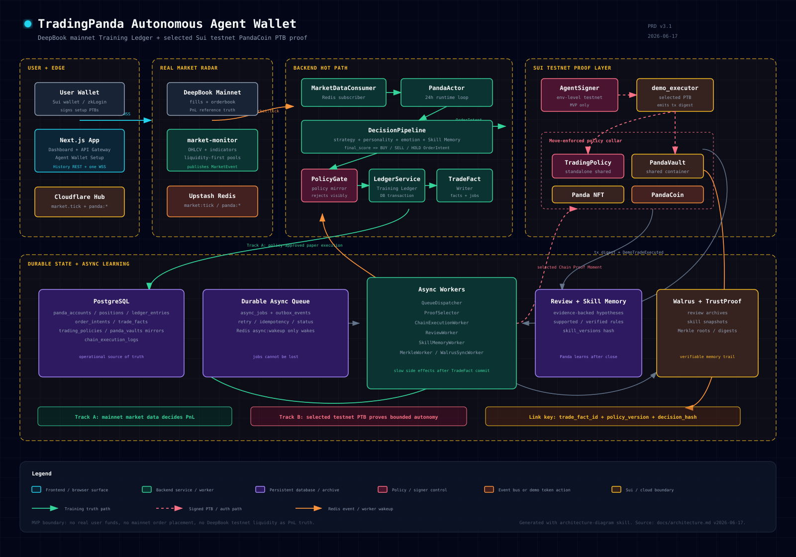
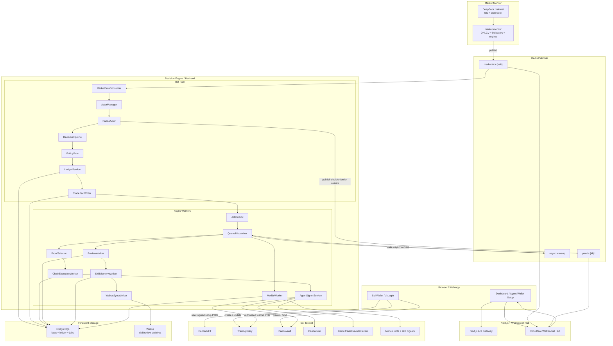
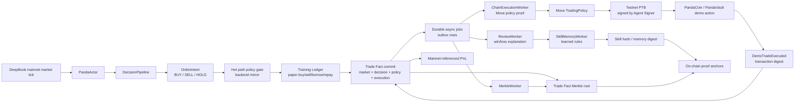
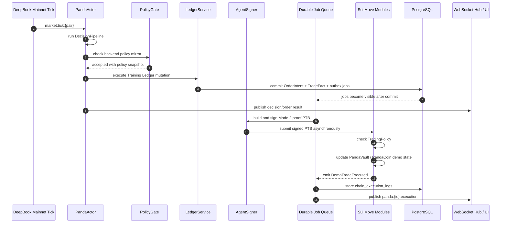
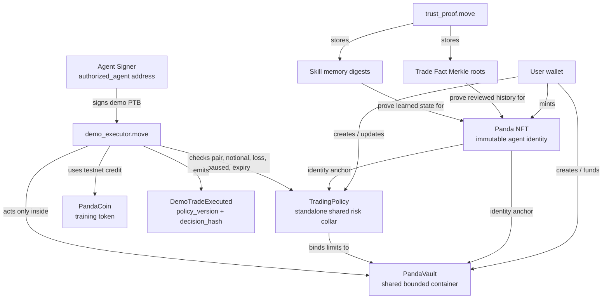

# TradingPanda Architecture — Autonomous Agent Wallet

> Last updated: 2026-06-17  
> Source of truth: `docs/PRD.md` v3.1  
> Positioning: Sui-native autonomous agent wallet trained on real DeepBook market data.

---

## 1. Architectural Thesis

TradingPanda is no longer described as a generic AI pet simulation. The architecture is a two-track autonomous agent wallet system:

```text
Track A — Training Truth
DeepBook mainnet real market data
→ Panda decision
→ backend Training Ledger
→ PnL / reviews / Skill Memory

Track B — Chain Execution Proof
Same decision intent
→ testnet PTB
→ PandaCoin / PandaVault demo action
→ TradingPolicy check
→ on-chain event + tx digest
```

The important boundary:

```text
Mainnet market data determines whether the Panda was right.
Testnet PTBs prove the Panda can act autonomously under Move-enforced rules.
```

Backend deployment principle:

```text
MVP backend is a modular monolith, not a microservice zoo.

Hot path:
market tick → PandaActor → DecisionPipeline → PolicyGate → Ledger → TradeFact

Async path:
TradeFactCommitted → durable queue → PTB proof / review / skill update / Merkle / Walrus
```

Only services with different runtime needs should be deployed independently. `market-monitor` and `websocket` are independent services. `PandaActor`, policy checks, ledger writes, and Trade Fact persistence stay close together in the backend hot path. Expensive or failure-prone side effects run through an asynchronous queue after the Trade Fact is committed.

Resolved architecture decisions:

| Decision | Architecture consequence |
|---|---|
| `PandaVault` is a shared object | User setup PTBs and authorized agent demo PTBs can both touch the same bounded container through Move checks. |
| `TradingPolicy` is a standalone shared object | Policy is readable/checkable by agent PTBs and updateable only through owner-gated entry functions. |
| MVP uses one environment-level testnet Agent Signer | This is a testnet training-gym robot, not user custody. Move policy/vault/panda bindings prevent cross-Panda authority. |
| Mode 2 runs only for selected Chain Proof Moments | The hot path stays fast; Sui RPC failures cannot block paper execution, reviews, or Skill Memory. |
| Launch pairs are liquidity-first | `market-monitor` ranks DeepBook mainnet pairs by recent volume, spread, depth, candle freshness, and monitor health. |

### 1.1 Polished Architecture Diagram



Source files:

- [SVG image](assets/trading-panda-architecture.svg)
- [HTML export version](assets/trading-panda-architecture.html) with Copy / PNG / PDF toolbar

---

## 2. Service Topology

```text
Browser
  │ HTTPS REST
  │ WSS market.tick + panda events
  ▼
Next.js App / API Gateway
  │
  ├── Sui wallet / zkLogin
  │      └── User signs transactions that create Panda NFT, PandaVault, and TradingPolicy
  │
  ├── WebSocket Hub
  │      └── SUBSCRIBE Redis market:* + panda:*
  │
  ▼
Decision Engine / Backend
  │
  ├── Hot path: synchronous decision runtime
  │      ├── MarketDataConsumer
  │      │      └── consumes market:tick:{pair}
  │      ├── ActorManager
  │      │      └── routes ticks to active PandaActors
  │      ├── PandaActor
  │      │      └── owns one Panda's live runtime state
  │      ├── DecisionPipeline
  │      │      └── turns market + strategy + memory into OrderIntent
  │      ├── PolicyGate
  │      │      └── checks current TradingPolicy snapshot
  │      ├── LedgerService
  │      │      └── executes Training Ledger mutation in DB transaction
  │      └── TradeFactWriter
  │             └── commits OrderIntent + execution result + outbox jobs
  │
  └── Async path: queued side-effect workers
         ├── JobOutbox / QueueDispatcher
         │      └── durable jobs created after TradeFact commit
         ├── ProofSelector
         │      └── selects eligible Trade Facts as Chain Proof Moments
         ├── ChainExecutionWorker
         │      └── selected Mode 2 testnet PandaCoin PTB proof
         ├── AgentSignerService
         │      └── signs only authorized testnet PTBs
         ├── ReviewWorker
         │      └── evidence-backed win/loss review
         ├── SkillMemoryWorker
         │      └── updates learned rules from reviewed Trade Facts
         ├── MerkleWorker
         │      └── batches Trade Fact roots
         └── WalrusSyncWorker
                └── archives memory and review snapshots

PostgreSQL
  ├── users / pandas / strategies
  ├── panda_vaults / trading_policies
  ├── order_intents / trade_facts
  ├── panda_accounts / panda_positions / ledger_entries
  ├── trade_reviews / skill_memories / skill_versions
  ├── async_jobs / outbox_events
  └── chain_execution_logs

Redis
  ├── market:tick:{pair}
  ├── market:heartbeat
  ├── panda:{id}:decision
  ├── panda:{id}:order_intent
  ├── panda:{id}:execution
  ├── panda:{id}:review
  ├── panda:{id}:skill
  └── async:wakeup

market-monitor
  ├── DeepBook mainnet fills / trades
  ├── DeepBook orderbook snapshots
  ├── OHLCV + indicators + market regime
  └── PUBLISH market:tick:{pair}

Sui Testnet
  ├── Panda NFT
  ├── TradingPolicy
  ├── PandaVault
  ├── PandaCoin
  ├── DemoTradeExecuted events
  ├── strategy hash / skill digest
  └── Merkle roots for Trade Facts

Walrus
  └── long-term Skill Memory and review archives
```

### 2.1 Architecture Diagram



---

## 3. Runtime Flow

### 3.0 Two-Track Runtime Diagram



### 3.1 Mint And Agent Wallet Setup

```text
User connects wallet / zkLogin
→ User signs mint transaction
→ Panda NFT is created with immutable personality
→ User creates PandaVault + TradingPolicy
→ TradingPolicy records authorized_agent, limits, allowed pairs, expiry, paused status
→ Backend mirrors policy and starts PandaActor when requested
```

### 3.2 Real Market Training Loop

```text
DeepBook mainnet
→ market-monitor
→ Redis market:tick:{pair}
→ PandaActor
→ DecisionPipeline
→ OrderIntent
→ PolicyGate check
→ LedgerService mutation
→ TradeFactWriter commit
→ async_jobs created
```

Mode 1 paper execution does not submit a PTB for every buy or sell. It does, however, check the same TradingPolicy rules and records a policy snapshot for each OrderIntent.

### 3.3 Testnet Chain Execution Proof

```text
TradeFact committed
→ ProofSelector checks eligibility
→ async_jobs.chain_proof_requested
→ ChainExecutionWorker builds testnet PTB
→ AgentSignerService signs with authorized_agent key
→ demo_executor.move checks TradingPolicy
→ PandaCoin / PandaVault demo action
→ DemoTradeExecuted event
→ chain_execution_logs row linked to Trade Fact
```

Mode 2 does not use DeepBook testnet liquidity as the source of PnL truth.

Automatic Chain Proof Moment eligibility:

| Rule | Default |
|---|---|
| Side | `BUY` or `SELL`, not `HOLD` |
| Decision zone | `EXECUTE` |
| Score | `final_score >= 0.75` |
| Demo enabled | `mode_2_demo_enabled = true` |
| Pair | Pair is in `demo_supported_pairs` |
| Policy | Pair, notional, expiry, paused status, and loss cap pass current policy |
| Cooldown | At most 1 automatic proof per Panda per 30 minutes |
| Daily cap | At most 10 automatic proofs per Panda per day |

Manual proof:

```text
User selects an existing Trade Fact in the Chain Proof Panel
→ ProofSelector bypasses score threshold only
→ policy, cooldown, duplicate, and daily-cap checks still apply
```

Idempotency key:

```text
trade_fact_id + policy_version + decision_hash
```

### 3.4 Hot Path And Async Queue Sequence



### 3.5 Review And Learning

```text
Position closes
→ realized PnL is known from mainnet reference prices
→ ReviewWorker explains win/loss from evidence
→ SkillMemoryWorker updates only evidence-backed hypotheses
→ skill hash / memory digest is periodically submitted on-chain
→ WalrusSyncWorker stores detailed memory archive
```

---

## 4. Sui Move Contracts

### 4.0 On-Chain Object Diagram



### 4.1 Implemented Modules

| Module | Role |
|---|---|
| `panda` | Panda NFT, immutable personality, transfer lock |
| `panda_registry` | Global mint registry |
| `strategy` | Strategy hash and strategy shadow dynamic fields |
| `experience` | Experience milestone and Walrus blob pointer |
| `trust_proof` | Merkle root submission and verification |
| `achievement` | Achievement registry and events |
| `market` | Kiosk integration stub |
| `deepbook_adapter` | Utility stub; not the MVP execution truth |

### 4.2 Modules To Add

| Module | Role |
|---|---|
| `trading_policy` | Create, update, pause, revoke standalone shared TradingPolicy |
| `panda_vault` | Create shared PandaVault and bind it to Panda + policy |
| `panda_coin` | Testnet-only training token |
| `demo_executor` | Execute selected Mode 2 PandaCoin demo trades with policy checks |

### 4.3 Contract Boundary

Move owns:

- Immutable Panda identity.
- User-approved policy boundaries.
- Agent authorization.
- Testnet execution proof.
- Trade batch / skill digest proof.

Move does not own in MVP:

- Mainnet paper PnL.
- Every paper ledger entry.
- Real asset custody.
- DeepBook mainnet order placement.

---

## 5. Backend Components

### 5.1 Deployment Boundary

The backend should not become a microservice zoo in MVP. Use a modular monolith with explicit internal boundaries and a durable async queue.

| Unit | MVP deployment | Split later? | Reason |
|---|---:|---:|---|
| `market-monitor` | Independent service | Already split | It polls DeepBook data on its own schedule and publishes `market:tick:*` |
| `websocket` Hub | Independent service | Already split | It owns long-lived browser connections and fan-out |
| `backend` API + Actor runtime | One backend service | Maybe | It owns auth, user APIs, PandaActor lifecycle, hot-path decisions, ledger commits |
| Async workers | Same backend process or one worker process | Yes | They are retryable side effects and can be scaled separately after MVP |
| `AgentSignerService` | Internal restricted module | Yes | It touches signing keys; future production should isolate it with minimum privileges |
| PostgreSQL | Managed database | No app split | It is the durable source of truth |
| Redis | Managed event bus | No app split | It is ephemeral pub/sub and wakeup, not durable truth |

### 5.2 Hot Path Modules

Hot path modules execute before or during Trade Fact commit. They must stay fast, deterministic, and close to the database transaction.

| Module | Role | State ownership | Side effects | Failure behavior |
|---|---|---|---|---|
| `MarketDataConsumer` | Subscribe to `market:tick:*` and convert Redis payloads into `MarketEvent` objects | No durable state | Reads Redis Pub/Sub | Dropped ticks are acceptable; next tick continues |
| `ActorManager` | Own active actor registry and route ticks to matching PandaActors | In-memory actor map | Starts/stops asyncio tasks | If backend restarts, actors are rehydrated when users restart training |
| `PandaActor` | Own one Panda's live runtime loop and short-lived decision state | In-memory queue, positions snapshot, emotion context | Publishes decision/order events | Must never directly move real user funds |
| `DecisionPipeline` | Score market tick using strategy, personality, emotion, experience, and skill inputs | Stateless pure computation except seeded RNG | None | Invalid inputs reject the decision before execution |
| `PolicyGate` | Check current TradingPolicy mirror before any executable intent | Reads policy snapshot from PostgreSQL/cache | Records policy result in Trade Fact | Policy failure becomes rejected intent, not silent drop |
| `LedgerService` | Apply Mode 1 Training Ledger mutations | PostgreSQL ledger rows, balances, positions | DB writes inside transaction | Roll back whole transaction on invalid mutation |
| `TradeFactWriter` | Persist canonical OrderIntent, execution snapshot, and async jobs | PostgreSQL `order_intents`, `trade_facts`, `async_jobs` | Creates outbox jobs atomically | If commit fails, async side effects must not run |

### 5.3 Async Worker Modules

Async workers run only after a durable Trade Fact exists. They are allowed to be slower, retryable, and eventually consistent.

| Module | Trigger | Role | Idempotency key | Failure behavior |
|---|---|---|---|---|
| `QueueDispatcher` | `async_jobs` row or `async:wakeup` | Claims due jobs and dispatches workers | `job_id` | Failed jobs retry with backoff |
| `ProofSelector` | `trade_fact_committed` job or manual proof request | Select eligible Chain Proof Moments and enqueue `chain_proof_requested` | `trade_fact_id + policy_version + decision_hash` | Duplicate requests become no-op; ineligible requests are recorded |
| `ChainExecutionWorker` | `chain_proof_requested` job | Build selected Mode 2 testnet PTB and attach tx digest to Trade Fact | `trade_fact_id + policy_version + decision_hash` | Store failed status; do not change paper PnL |
| `AgentSignerService` | Called by ChainExecutionWorker | Sign only authorized testnet PTBs for the configured agent address | PTB digest / intent hash | Refuse if policy version, agent address, or mode mismatches |
| `ReviewWorker` | `position_closed` or `review_requested` job | Generate evidence-backed win/loss review | `trade_fact_id` | Retry; no review means no skill update |
| `SkillMemoryWorker` | `review_completed` job | Update reviewed Skill Memory and version hash | `review_id + skill_version` | Must not update memory without review evidence |
| `MerkleWorker` | batch threshold or scheduled job | Build Trade Fact Merkle root and submit proof anchor | `panda_id + batch_index` | Retry chain submission; root is deterministic |
| `WalrusSyncWorker` | `skill_snapshot_ready` or scheduled job | Archive Skill Memory and review batches to Walrus | content digest | Retry upload; keep digest pending until confirmed |
| `EventPublisher` | worker completion | Publish `panda:{id}:execution/review/skill` events | event id | UI notification can be retried or skipped; DB remains source of truth |

### 5.4 Queue Contract

The queue must be durable. Redis Pub/Sub can wake workers, but it must not be the source of truth for tasks that cannot be lost.

MVP queue contract:

```text
TradeFactWriter commits:
  order_intents
  trade_facts
  ledger_entries
  async_jobs

QueueDispatcher polls:
  async_jobs where status = pending and run_at <= now()

Worker updates:
  async_jobs.status = completed | retrying | failed
  async_jobs.attempt_count += 1
  async_jobs.last_error = ...
```

Redis usage:

```text
Redis is for market ticks, realtime UI events, and async worker wakeups.
PostgreSQL async_jobs is the durable queue of record.
```

### 5.5 Data Flow Ownership

```text
Hot path owns correctness:
market tick → decision → policy gate → ledger mutation → Trade Fact commit

Async path owns enrichment:
Trade Fact → chain proof → review → skill update → Merkle root → Walrus archive
```

The hot path should finish even if Sui RPC, Walrus, DeepSeek review calls, or tx submission are temporarily unavailable. Those failures are stored on jobs and retried later.

### 5.6 Why Not Split Every Service Now

Do not deploy `PolicyService`, `LedgerService`, `ReviewService`, and `SkillMemoryService` as separate network services in MVP.

Reasons:

- Policy and ledger checks are part of the same correctness boundary as Trade Fact commit.
- Network calls inside the tick path would add latency and new failure modes.
- Cross-service transactions would make ledger and Trade Fact consistency harder.
- Most modules are not independently scalable yet; they are independently named to keep the codebase clean.
- Worker extraction remains easy if module contracts stay explicit and jobs are durable.

Recommended evolution:

| Stage | Deployment shape | When to move on |
|---|---|---|
| MVP | Modular monolith backend + internal async workers | Until hot path latency, worker retries, or signer security becomes painful |
| Post-MVP | Separate `worker` process for review/skill/merkle/walrus jobs | When background jobs compete with actor CPU or DB pool |
| Production signer | Isolated `agent-signer` service or key-management boundary | Before real funds or high-value policies |
| Real trading | Separate execution/risk service | Before Mode 3 real asset custody or DeepBook order placement |

### 5.7 Agent Signer Contract

MVP uses one environment-level testnet Agent Signer. This is acceptable only because Mode 2 uses testnet PandaCoin and has no real economic value.

The signer is not a magical Panda owner. It can submit a transaction, but Move decides whether that transaction is legal.

Required safeguards:

| Safeguard | Rule |
|---|---|
| Policy binding | `TradingPolicy.authorized_agent` must equal the signer address. |
| Panda binding | `TradingPolicy.panda_id`, `PandaVault.panda_id`, and Trade Fact `panda_id` must match. |
| Vault binding | `PandaVault.policy_id` must match the policy used by `demo_executor`. |
| Version binding | PTB uses the current `policy_version`; stale proofs are rejected or marked failed. |
| Mode binding | Signer signs only Mode 2 testnet PandaCoin demo PTBs in MVP. |
| Idempotency | `trade_fact_id + policy_version + decision_hash` must be unique. |

Rotation:

```text
backend generates or configures a new signer key
→ users sign TradingPolicy update changing authorized_agent
→ policy_version increments
→ old signer can no longer pass Move policy checks
```

Revocation:

```text
user pauses policy or revokes authorized_agent
→ backend PolicyGate rejects hot-path paper execution
→ demo_executor rejects Mode 2 PTBs
→ pending chain proof jobs become cancelled or failed
```

Before Mode 3 real assets, replace this environment-level signer with stronger isolation such as per-Panda signer keys, user-scoped session keys, or KMS-backed signing.

---

## 6. Data Stores

### 6.1 PostgreSQL

PostgreSQL is the operational source of truth for:

- User and Panda mirrors.
- Policies and vault metadata.
- OrderIntents.
- Training Ledger balances and entries.
- Trade Facts.
- Reviews.
- Skill Memory.
- Chain execution logs.

### 6.2 Redis

Redis is an ephemeral event bus. It is not durable storage.

### 6.3 Walrus

Walrus stores long-term archives:

- Skill Memory snapshots.
- Review archives.
- Trade Fact batches.
- Optional Panda diary output.

Blob IDs or memory digests can be referenced from Sui dynamic fields.

---

## 7. Frontend Surfaces

| Surface | Purpose |
|---|---|
| Mint | Create Panda NFT |
| Agent Wallet Setup | Create PandaVault and TradingPolicy |
| Policy Collar | Explain limits: budget, pairs, daily loss, agent address |
| PandaVault | Show training balance, debt, equity, positions |
| Market Radar | Show DeepBook chart, indicators, market regime |
| Decision Timeline | Show OrderIntents and policy results |
| Chain Proof Panel | Show testnet tx digest, event, decision hash |
| Review Journal | Show win/loss reviews and Skill Memory changes |
| Emergency Controls | Pause, revoke, tighten policy |

---

## 8. Network Strategy

| Concern | MVP choice |
|---|---|
| Market data | DeepBook mainnet as Training Truth |
| Paper execution | Backend Training Ledger |
| On-chain proof | Sui testnet |
| Demo token | PandaCoin / PANDA_CREDIT |
| Real asset trading | Out of MVP |
| Real borrowing / margin | Out of MVP |

---

## 9. Resolved Architecture Decisions

| Topic | Decision |
|---|---|
| `PandaVault` object model | Shared object |
| `TradingPolicy` object model | Standalone shared object |
| Agent Signer model | One environment-level testnet signer for MVP Mode 2 only |
| Agent Signer rotation | New signer key plus user-signed `TradingPolicy` update |
| Agent Signer revocation | User pauses policy or clears `authorized_agent`; both PolicyGate and Move checks block execution |
| Mode 2 frequency | Selected automatic Chain Proof Moments plus manual user-triggered proof |
| Launch market selection | Liquidity-first DeepBook mainnet pairs |

Remaining implementation choices:

1. Final PandaCoin symbol, decimals, and faucet/admin minting UX.
2. Exact evidence threshold for promoting Skill Memory from `supported` to `verified`.
3. Final mainnet pool IDs after market-monitor liquidity ranking.

---

## 10. Related Documents

| Document | Role |
|---|---|
| `docs/PRD.md` | Product source of truth |
| `CONTEXT.md` | Canonical product language |
| `docs/adr/0001-mainnet-training-ledger-with-testnet-execution-proof.md` | Two-track MVP decision |
| `docs/market-monitor-design.md` | Real market data service |
| `docs/agent-design.md` | Panda decision and learning system |
| `docs/database-schema.md` | Data model |
| `docs/contract-design.md` | Move object model |
