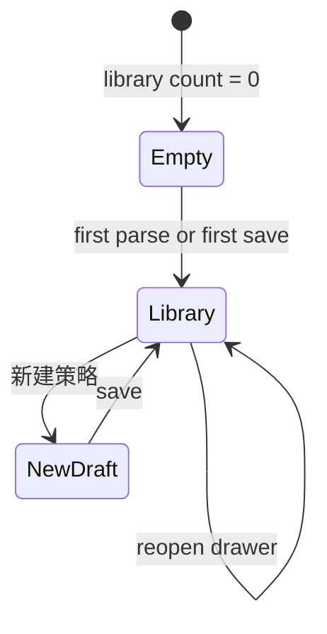

# Page Design: Feed Strategy (Training Ledger Drawer)

> Journey: J3 · Surface: `FeedStrategyDrawer` on `/training-ledger/[id]` · Mood: teach signals, not permissions

---

## 1. Page Purpose

Feed Strategy teaches the Panda **when to lean buy or sell** based on market signals. It does **not** expand Agent Wallet permission.

The drawer should answer:

```text
"What signals should my Panda watch, and which saved playbook is live?"
```

**Product sentence (user-facing):**

> 策略教熊猫「什么信号出现时倾向买或卖」。最终是否行动，还要看性格、经验和钱包风控。

---

## 2. User Mental Model

| Concept | Meaning | User sees |
|---------|---------|-----------|
| **策略剧本** | A set of `signal_rules` (indicator → condition → BUY/SELL) | Rule blocks + human summary |
| **保存策略** | Write to this Panda's strategy library; **not yet live** | Left list item: `已保存` |
| **喂给熊猫** | Set one strategy as **active** for training | Left list item: `正在喂给熊猫` |
| **策略残影** | Previous active strategy fades over trades | One-line story when switching |

**Hard rules:**

- One Panda → one **active** strategy at a time.
- Strategy library is **per Panda** (not global).
- Saving ≠ feeding. Feeding always requires explicit confirmation.
- Editing the **active** strategy **directly updates** the live playbook (no fork-to-new-version prompt).

---

## 3. Container & Entry

| Item | Decision |
|------|----------|
| Shell | Wide **Drawer** on Training Ledger (desktop ≥960px) |
| Triggers | Rail `Feed strategy`, `?feed=strategy`, Start training without strategy |
| Desktop layout | Left ~35% library + input · Right ~65% builder |
| Mobile layout | Top strategy selector + input · Bottom builder |

---

## 4. Screen States



| State | Condition | UI |
|-------|-----------|-----|
| **Empty** | No saved strategies for this Panda | Full-width **LLM interpreter only** |
| **Library** | ≥1 saved strategy | Left/right split immediately on open |
| **NewDraft** | User clicked 新建 or finished LLM parse | Right = unsaved blocks; left = input |

---

## 5. Empty State (First Visit)

```text
┌─ Feed Strategy ─────────────────────────────────────┐
│  教熊猫：什么信号出现时，该买还是卖？                 │
│  ┌───────────────────────────────────────────────┐  │
│  │ 例如：跌多了再买，涨多了就卖，单笔别超过 10%    │  │
│  └───────────────────────────────────────────────┘  │
│              [ 让 AI 写策略 ]                        │
│  解析后你可以微调规则，再决定是否喂给熊猫。            │
└─────────────────────────────────────────────────────┘
```

- No template rack, no library, no rule blocks.
- **LLM failure (option B):** stay on screen; show「请说得更具体一点」+ 3 examples; keep user input.
- **No auto-fallback to templates** on parse failure.

---

## 6. Library Layout (Desktop)

```text
┌─ Feed Strategy ─────────────────────────────────────────────────────────┐
│ 策略教熊猫何时倾向买卖；最终行动仍受钱包风控约束。                          │
├──────────────────────────────┬──────────────────────────────────────────┤
│ 左栏 · 策略库                 │ 右栏 · 策略积木                           │
│ [+ 新建策略]                  │ [可编辑标题]  低买高卖 · RSI                │
│                              │ 人话摘要…                                 │
│ ● 正在喂给熊猫               │ ── 信号规则 (StrategyBuilder) ──          │
│   低买高卖 · RSI             │ ── 仓位 / 止损 (折叠) ──                  │
│                              │ Policy：兼容 ✓ (冲突时展开)                 │
│ ○ 已保存                     │ Ghost 提示 (仅切换 active 时)             │
│   趋势跟随草稿    [喂给熊猫]  │                                          │
│                              │ [保存策略]                                │
│ [自然语言输入…]              │                                          │
│ [让 AI 写策略]               │                                          │
└──────────────────────────────┴──────────────────────────────────────────┘
```

### 6.1 Left — Strategy library

- Sorted by `created_at` desc.
- Row shows: **title**, saved time, status chip.
- **Title:** default AI auto-summary; user may rename (persisted as `raw_text` display name).
- **正在喂给熊猫:** green chip + check (max one).
- Row actions:
  - Click row → load in right editor.
  - **喂给熊猫** (saved only) → confirm dialog → activate one-click.
- Bottom: NL input + **让 AI 写策略** (creates new right-side draft).

### 6.2 Right — Strategy editor

1. **Editable title** (auto-filled on parse/save).
2. **Human summary** (1–3 sentences, from parse).
3. **Full rule blocks** (`StrategyBuilder`, `showTemplates=false`, `showActions=false`).
4. **Position / stop** (compact sliders, collapsible).
5. **Policy** one-line status; expand + Agent Wallet link on conflict.
6. **Ghost** one line when feed would replace current active strategy.

**Primary CTA:** `[保存策略]` — validates server-side; does not activate.

**No standalone Validate button.**

---

## 7. Core Flows

### 7.1 First create (Empty → Library)

```text
NL input → AI parse → right draft
→ user edits blocks / title
→ Save
→ Confirm dialog: 是否现在喂给熊猫？
   · 稍后 →入库 only
   · 喂给熊猫 → activate
```

### 7.2 Reopen (Library-first)

```text
Open drawer → left/right immediately
→ right shows active strategy (or most recent if none active)
```

### 7.3 Feed from library (one-click)

```text
Click 喂给熊猫 on saved row
→ Confirm dialog
→ Activate (ghost if replacing)
→ toast + refresh list
```

### 7.4 Save without feed

```text
Save → Confirm → 稍后
→ row appears as 已保存; active unchanged
```

### 7.5 Edit active strategy

```text
Load active row → edit blocks → Save
→ updates live playbook directly (no version fork prompt)
→ toast: 熊猫正在使用的剧本已更新
```

---

## 8. Confirm Dialog — 喂给熊猫？

```text
┌─ 喂给熊猫？ ──────────────────────────┐
│ 剧本：{title}                        │
│ 摘要：{human summary}                │
│ · 替换当前「{active title}」(if any)  │
│ · 旧习惯会慢慢消退                    │
│ · Policy 兼容 ✓ / ✗                  │
│        [稍后]          [喂给熊猫]     │
└───────────────────────────────────────┘
```

| Case | Copy |
|------|------|
| First feed (no active) | Omit replace line;「喂给后熊猫可以开始训练」 |
| Policy conflict | Disable 喂给熊猫; link to Agent Wallet |
| `is_trading` | Disable;「先停止训练再换策略」 |

---

## 9. Core Components

| Component | Responsibility |
|-----------|----------------|
| `FeedStrategyDrawer` | State machine, queries, save/feed orchestration |
| `FeedStrategyEmptyState` | LLM-only first screen + parse failure hints |
| `FeedStrategyLibraryPanel` | Left list, status chips, feed shortcuts, NL input |
| `FeedStrategyEditorPanel` | Title, summary, `StrategyBuilder`, policy/ghost |
| `FeedStrategyConfirmDialog` | Post-save or list-item feed confirmation |
| `PolicyCompatibilityPreview` | One-line + expanded conflict |
| `GhostInfluenceHint` | Story when switching active strategy |

---

## 10. API Contract (MVP)

| Method | Path | Purpose |
|--------|------|---------|
| `POST` | `/api/panda/:id/strategy/parse` | LLM parse only; no DB write |
| `GET` | `/api/panda/:id/strategies` | List all strategies + `is_active` |
| `POST` | `/api/panda/:id/strategy` | Save; `activate: false` = draft, `true` = feed |
| `PATCH` | `/api/panda/:id/strategy/:strategyId` | Update title + `parsed` |
| `POST` | `/api/panda/:id/strategy/:strategyId/activate` | Activate saved row |
| `GET` | `/api/panda/:id/strategy` | Active strategy (unchanged) |

---

## 11. Progressive Disclosure

| Layer | Visible |
|-------|---------|
| Default | NL input, library list, human summary, rule blocks, Save |
| On save | Feed confirm dialog |
| On conflict | Policy detail + Agent Wallet link |
| On switch | Ghost one-liner |
| Hidden | `ghost_weight` numeric, raw LLM prompt, strategy hash |

---

## 12. Failure States

| Failure | Response |
|---------|----------|
| LLM parse fail / vague input | Stay Empty; examples + retry (no template auto-pick) |
| Rule compile error | Highlight rows; block save |
| Policy conflict | Block feed; show pair/position conflict |
| Save while training | Block strategy change; stop training first |
| Network error | Keep local draft; retry |

---

## 13. Out of Scope (MVP)

- Global cross-Panda strategy library
- Multiple simultaneous active strategies
- Template rack on Empty screen
- Standalone `/strategy/[id]` route (removed; drawer only)
- Fork-on-edit for active strategy

---

## 14. Prototype Notes

Show the boundary: **Strategy = signal playbook · Policy = risk collar · Panda = decides with personality + experience.**

The drawer should feel like「写剧本 → 存库 → 选一条上场」, not like a trading terminal.
